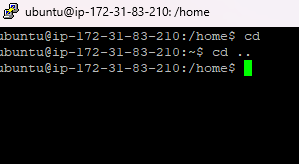

## Day 2 Assessment — Basic Navigation

### 1. Find your starting location

Determine the complete filesystem path of your current location.

**Submit:** The absolute path.

ubuntu@ip-172-31-83-210:/home$


---

### 2. Navigate using an absolute path

Move to the system directory that contains the server's log files.

**Submit:** The absolute path of the directory you are now in.

---

### 3. Navigate using a relative path

From the directory containing the system logs, move one level upward and then into its `log` directory again using **only a relative path**.

**Submit:** The resulting absolute path.

---

### 4. Return home

Without manually typing the full path to your home directory, return to your own home directory.

**Submit:** The absolute path of your home directory.

---

### 5. Find hidden files

Inspect your home directory and determine how many entries are hidden files or hidden directories.

**Submit:** The number of hidden entries you find.

---

### 6. Identify directories

Display the contents of your home directory in a detailed listing and determine which entries are directories rather than ordinary files.

**Submit:** The names of all directories in your home directory.

---

### 7. Create a directory structure

Inside your home directory, create this structure:

```text
linux-assessment/
└── day2/
    └── files/
```

**Submit:** The command sequence you used.

---

### 8. Create and relocate a file

Create an empty file named `navigation-test` in your home directory. Then move it into the `files` directory you created in Question 7.

**Submit:** The final path of the file.

---

### 9. Move a directory

Create a directory named `archive` inside `linux-assessment`. Move the `files` directory into `archive`.

Your resulting structure should be:

```text
linux-assessment/
└── day2/
    └── archive/
        └── files/
            └── navigation-test
```

**Submit:** The final path of `navigation-test`.

---

### 10. Clean up

Remove everything you created for this assessment without deleting anything that existed in your home directory before you began.

**Submit:** A listing demonstrating that your `linux-assessment` directory no longer exists.

### Optional Challenge — Documentation

A Linux administrator does not need to memorize every command.

Without searching the web, use the documentation available on the server to determine **which command can show a concise description of another command based on a keyword or phrase**.

**Submit:** The command you discovered and a one-sentence explanation of what it does.
